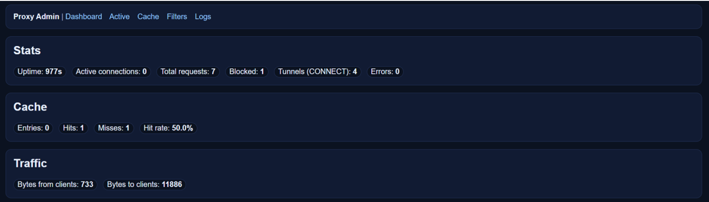
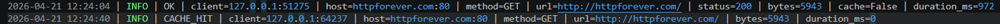
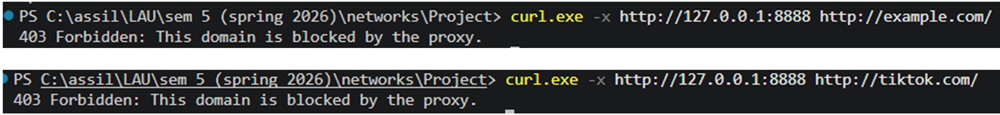
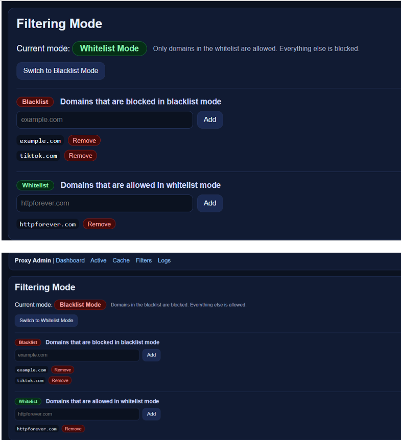
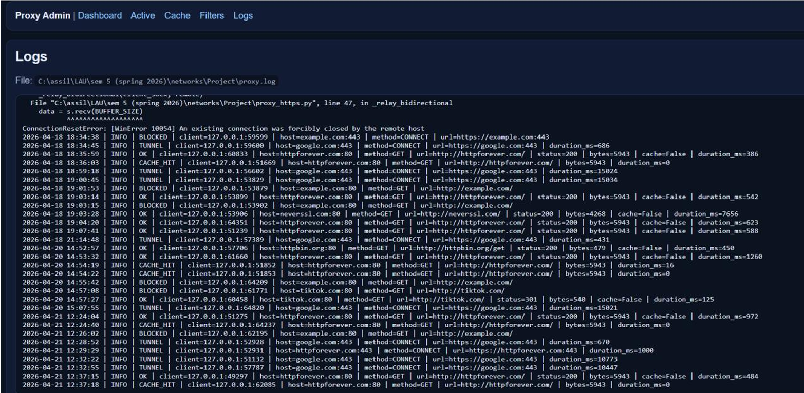
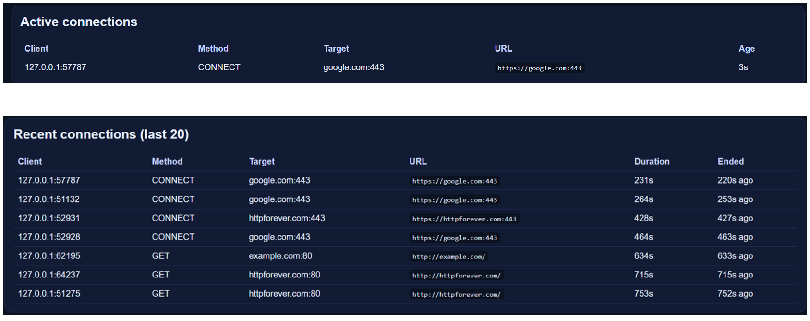

# Python Caching Proxy Server


---

## Overview

This project implements a multi-threaded caching proxy server using Python socket programming.

The proxy server acts as an intermediate system between clients and target web servers. Instead of clients communicating directly with web servers, requests are first processed by the proxy, which can:

- forward HTTP requests
- tunnel HTTPS traffic
- cache responses
- block domains using blacklist/whitelist filtering
- log all network activity
- monitor live connections through a web-based admin interface

The project demonstrates several core networking concepts including:

- socket programming
- HTTP request parsing
- HTTPS CONNECT tunneling
- multithreading
- caching systems
- concurrent connection handling
- proxy filtering
- logging and monitoring

---

## Key Features

- HTTP request forwarding
- HTTPS CONNECT tunneling
- In-memory response caching
- Blacklist and whitelist filtering
- Multi-threaded client handling
- Real-time admin dashboard
- Active connection monitoring
- Request and error logging
- Cache management interface
- Live proxy statistics

---

## System Architecture

The communication flow of the proxy server is:

```text
Client → Proxy Server → Target Server
       ←              ←
```

Instead of direct communication between the client and the internet, all traffic flows through the proxy server.

The proxy:

1. receives the client request
2. parses the request
3. checks filtering rules
4. checks the cache
5. forwards the request if necessary
6. returns the response to the client
7. logs all activity

---

## Admin Interface

The project includes a web-based admin interface for monitoring and controlling the proxy server in real time.

Features include:

- live statistics dashboard
- log monitoring
- cache inspection and deletion
- blacklist and whitelist management
- active connection monitoring
- recent connection history



---

## Technologies Used

- Python
- Socket Programming
- Multithreading
- HTTP/HTTPS Protocols
- ThreadingHTTPServer
- TCP Networking
- Select-based I/O multiplexing

---

## Project Structure

```text
python-caching-proxy-server/
│
├── proxy_server.py
├── proxy_http.py
├── proxy_https.py
├── proxy_cache.py
├── proxy_filters.py
├── proxy_logging.py
├── proxy_state.py
├── proxy_admin_server.py
│
├── README.md
├── requirements.txt
├── Proxy_Server_Report.pdf
├── proxy.log
│
└── images/
```

---

## File Descriptions

### `proxy_server.py`

Main proxy server implementation.

Responsibilities:

- socket setup
- accepting client connections
- spawning threads
- forwarding requests
- cache integration
- blacklist/whitelist enforcement
- HTTPS tunnel handling

---

### `proxy_http.py`

Handles:

- HTTP request parsing
- target extraction
- request rebuilding
- response header parsing
- cache TTL computation

---

### `proxy_https.py`

Implements HTTPS forwarding using the CONNECT tunneling method.

The proxy forwards encrypted traffic without decrypting or inspecting TLS data.

---

### `proxy_cache.py`

Implements the in-memory caching system.

Features:

- TTL-based expiration
- cache hit/miss handling
- cache cleanup
- cache management functions

---

### `proxy_filters.py`

Implements:

- blacklist filtering
- whitelist filtering
- subdomain matching
- runtime mode switching

---

### `proxy_logging.py`

Configures the shared logger used by all modules.

Logs are written to:

```text
proxy.log
```

---

### `proxy_state.py`

Tracks:

- total requests
- blocked requests
- cache hits/misses
- active connections
- recent connections
- transferred bytes

---

### `proxy_admin_server.py`

Implements the web-based admin dashboard using Python's built-in `ThreadingHTTPServer`.

---

## HTTP Forwarding

The proxy accepts HTTP requests from clients and forwards them to the target server.

Example test command:

```bash
curl.exe -x http://127.0.0.1:8888 http://httpbin.org/get
```

---

## HTTPS CONNECT Tunneling

The proxy supports HTTPS forwarding using the CONNECT tunneling method.

Example:

```bash
curl.exe -x http://127.0.0.1:8888 https://google.com/
```

The proxy:

1. establishes a TCP tunnel
2. returns `200 Connection Established`
3. relays encrypted bytes between client and server

The TLS traffic is never decrypted or inspected.

---

## Multithreading

The proxy uses one thread per client connection.

This allows multiple clients to be handled concurrently without blocking the server.

The multithreaded design is especially important for:

- HTTPS tunnels
- slow target servers
- simultaneous requests

---

## Content Caching

The proxy includes an in-memory caching system for GET requests.

Caching behavior:

- first request → cache miss
- repeated request → cache hit

The cache uses:

- `Cache-Control`
- `Expires`
- fallback TTL rules

to determine expiration times.

### Cache Demonstration

```bash
curl.exe -x http://127.0.0.1:8888 http://httpforever.com/
curl.exe -x http://127.0.0.1:8888 http://httpforever.com/
```

The second request should be served directly from cache.



---

## Domain Filtering

The proxy supports both:

- blacklist mode
- whitelist mode

### Blacklist Mode

Blocked domains return:

```text
403 Forbidden
```

Example:

```bash
curl.exe -x http://127.0.0.1:8888 http://example.com/
```



---

### Whitelist Mode

Only explicitly allowed domains are accessible.

All others are blocked automatically.

The filtering mode can be changed dynamically from the admin interface without restarting the server.



---

## Logging

All proxy activity is recorded in:

```text
proxy.log
```

Logged events include:

- successful requests
- cache hits
- blocked requests
- HTTPS tunnels
- connection errors
- response sizes
- request duration

### Example Log Types

- `OK`
- `CACHE_HIT`
- `BLOCKED`
- `TUNNEL`
- `ERROR`



---

## Active Connections Monitoring

The admin interface displays:

- live active connections
- recently completed connections
- request metadata
- tunnel activity

This helps demonstrate:

- concurrency
- multithreading
- real-time monitoring



---

## Requirements

- Python 3.10+
- curl (recommended for testing)

The project uses mostly Python standard libraries.

---

## Installation

Clone the repository:

```bash
git clone https://github.com/AssilHalawi/python-caching-proxy-server
cd python-caching-proxy-server
```

---

## Run the Proxy Server

```bash
python proxy_server.py --host 127.0.0.1 --port 8888
```

Admin interface:

```text
http://127.0.0.1:8890/
```

---

## End-to-End Testing

### HTTP Test

```bash
curl.exe -x http://127.0.0.1:8888 http://httpbin.org/get
```

---

### HTTPS Test

```bash
curl.exe -x http://127.0.0.1:8888 https://google.com/
```

---

### Cache Test

```bash
curl.exe -x http://127.0.0.1:8888 http://httpforever.com/
curl.exe -x http://127.0.0.1:8888 http://httpforever.com/
```

---

### Blacklist Test

```bash
curl.exe -x http://127.0.0.1:8888 http://example.com/
```

---

### Whitelist Test

Switch to whitelist mode from:

```text
http://127.0.0.1:8890/filters
```

Then test:

```bash
curl.exe -x http://127.0.0.1:8888 http://httpforever.com/
```

---

## Challenges Faced

Some challenges encountered during development included:

- handling concurrent client connections safely
- parsing multiple HTTP request formats
- implementing HTTPS tunneling correctly
- managing cache expiration
- preventing socket blocking and timeouts
- synchronizing shared proxy state across threads

---

## Future Improvements

Possible future extensions include:

- persistent disk-based caching
- rate limiting
- bandwidth monitoring
- MITM HTTPS inspection using certificates
- authentication support
- Docker deployment
- graphical analytics dashboard

---

## Conclusion

This project demonstrates a complete implementation of a multi-threaded HTTP/HTTPS proxy server using low-level socket programming in Python.

The implementation combines:

- networking
- concurrency
- caching
- request parsing
- filtering
- logging
- monitoring

into a modular and fully functional system.

The project also highlights practical networking concepts such as HTTP forwarding, HTTPS tunneling, concurrent connection handling, and real-time proxy administration.